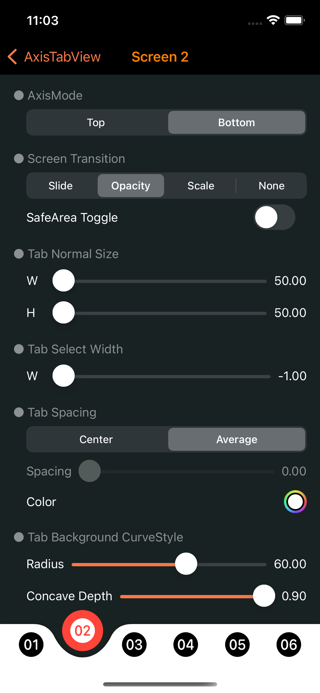
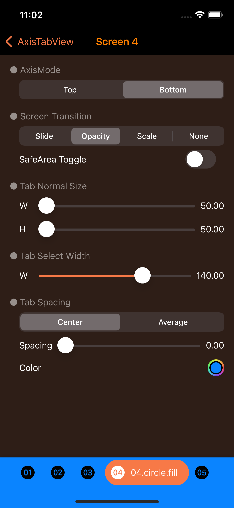
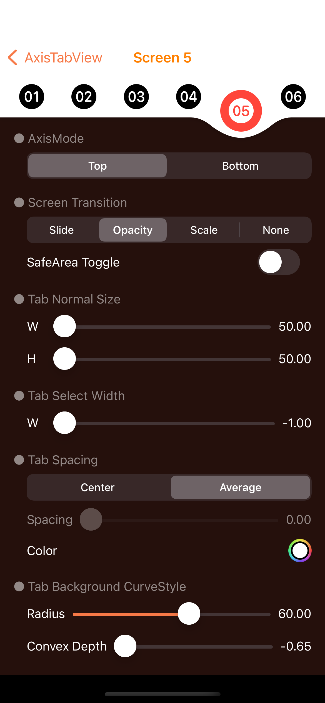
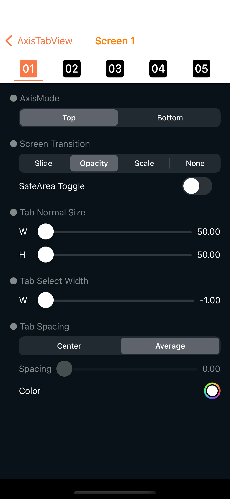
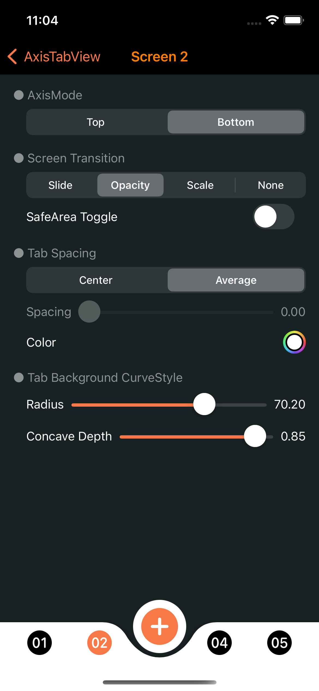

# **AxisTabView for SwiftUI**
A library that allows you to easily create various styles of tab views. Supports iOS and macOS.

[](https://developer.apple.com/macOS)
[](https://developer.apple.com/iOS)
[](https://developer.apple.com/macOS)
[](https://www.instagram.com/dev.fabula)
[](https://developer.apple.com/documentation/swift_packages/package/)
[](https://opensource.org/licenses/MIT)  

## Screenshot
|Style|Style|Style|
|:---:|:---:|:---:|
||||
||||

https://user-images.githubusercontent.com/1617304/158022934-d50b44be-a18f-4dbe-a079-09256823bba0.mov

https://user-images.githubusercontent.com/1617304/158058477-eed42ea0-3b2d-496f-b978-f2f6628a3801.mov

## Example
[https://fabulaapp.page.link/233](https://fabulaapp.page.link/233)

## Usages
```swift
AxisTabView(selection: $selection, constant: ATConstant(axisMode: .bottom)) { state in
    ATBasicStyle(state, color: .blue)
} content: {
    Text("Tab 1")
        .tabItem(tag: 0, normal: {
            Text("Tab 1")
        }, select: {
            Text("Tab 1")
                .bold()
                .foregroundColor(Color.yellow)
        })
    Text("Tab 2")
        .tabItem(tag: 1, normal: {
            Text("Tab 2")
        }, select: {
            Text("Tab 2")
                .bold()
                .foregroundColor(Color.yellow)
        })
    Text("Tab 3")
        .tabItem(tag: 2, normal: {
            Text("Tab 3")
        }, select: {
            Text("Tab 3")
                .bold()
                .foregroundColor(Color.yellow)
        })
} onTapReceive: { selectionTap in
    /// Imperative syntax
    print("---------------------")
    print("Selection : ", selectionTap)
    print("Already selected : ", self.selection == selectionTap)
}
```
  
## Swift Package Manager
The Swift Package Manager is a tool for automating the distribution of Swift code and is integrated into the swift compiler. Once you have your Swift package set up, adding AxisTabView as a dependency is as easy as adding it to the dependencies value of your Package.swift.

```swift
dependencies: [
    .package(url: "https://github.com/jasudev/AxisTabView.git", .branch("main"))
]
```

## Contact
instagram : [@dev.fabula](https://www.instagram.com/dev.fabula)  
email : [dev.fabula@gmail.com](mailto:dev.fabula@gmail.com)

## License
AxisTabView is available under the MIT license. See the [LICENSE](LICENSE) file for more info.
